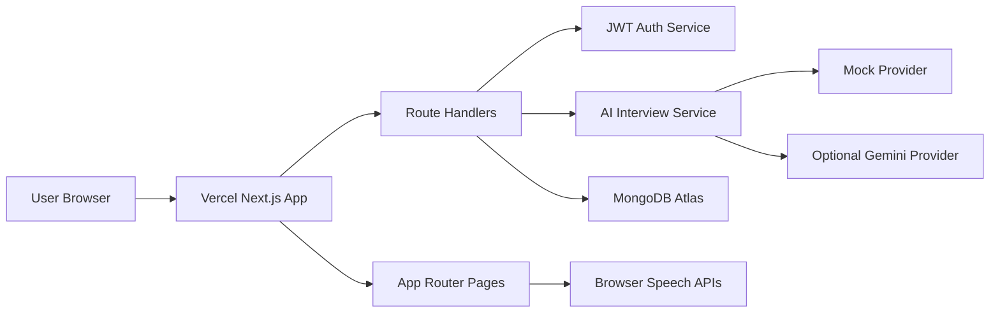

# Prepwise AI

AI-powered interview practice platform for students and job seekers.

[Live Demo](https://prepwise-ai-sooty.vercel.app) · [Architecture Plan](docs/technical-plan.md) · [Repository](https://github.com/Rajtiwari0202/prepwise-ai)

Prepwise AI is a full-stack, open-source interview simulator built like a real product: authenticated dashboards, resume-aware interview setup, live AI interview sessions, browser voice input/output, structured feedback reports, weakness analysis, and interview history.

The project is intentionally designed to be free to run. It ships with a deterministic local mock AI provider by default and includes an optional Gemini provider behind an abstraction layer. OpenAI and paid-only services are not required.

## Screenshots

### Landing Page


### Dashboard


### Create Interview


### Live Interview Room


### Feedback Report


### Resume Profile


## What It Does

Prepwise AI helps candidates practice interviews in a realistic loop:

1. Choose an interview mode.
2. Select a target role and difficulty.
3. Answer questions by text or voice.
4. Receive AI evaluation after each answer.
5. Generate a structured feedback report.
6. Track past sessions and improvement areas.

Supported modes:

- DSA interviews
- HR and behavioral interviews
- Resume-based interviews
- Mixed interviews

## Core Features

- AI interviewer with provider abstraction
- Browser voice input using `SpeechRecognition`
- Browser voice output using `SpeechSynthesis`
- DSA, HR, resume-based, and mixed interview modes
- Resume/profile context for personalized questions
- Answer evaluation with score, strengths, and improvements
- Feedback report with:
  - Overall score
  - Communication score
  - Technical score
  - Confidence score
  - Strengths
  - Weaknesses
  - Missed concepts
  - Suggested improvements
  - Recommended revision topics
  - Better sample answers
  - Interview transcript
- Interview history dashboard
- User authentication
- Protected interview and report routes
- Free default mock AI provider
- Optional Gemini provider
- Production-ready folder structure
- Type-safe validation and database models

## Tech Stack

| Layer | Technology |
| --- | --- |
| Frontend | Next.js App Router, React, TypeScript |
| Styling | Tailwind CSS |
| Backend | Next.js Route Handlers |
| Database | MongoDB, Mongoose |
| Auth | Custom JWT, HTTP-only cookies, bcrypt |
| Validation | Zod |
| AI | Provider abstraction, mock provider, optional Gemini |
| Voice | Browser Web Speech APIs |
| Deployment | Vercel + MongoDB Atlas |

## Architecture



Key backend routes:

```text
app/api/auth/*
app/api/interviews/*
app/api/profile/*
app/api/reports/*
```

Key service layers:

```text
lib/ai/interviewService.ts
lib/ai/providers/mock.ts
lib/ai/providers/gemini.ts
lib/auth/session.ts
lib/db/mongoose.ts
```

## Project Structure

```text
app/
  api/
  auth/
  dashboard/
  history/
  interview/
  profile/
  reports/
components/
  auth/
  interview/
  layout/
  profile/
  reports/
  ui/
data/
docs/
hooks/
lib/
  ai/
  auth/
  db/
  utils/
  validators/
models/
public/
  screenshots/
types/
```

## Getting Started

### 1. Clone the repository

```bash
git clone https://github.com/Rajtiwari0202/prepwise-ai.git
cd prepwise-ai
```

### 2. Install dependencies

```bash
npm install
```

### 3. Configure environment variables

Create `.env` from `.env.example`.

```bash
MONGODB_URI=mongodb://127.0.0.1:27017/interview_ai
JWT_SECRET=replace-with-a-long-random-secret
AI_PROVIDER=mock
GEMINI_API_KEY=
GEMINI_MODEL=gemini-1.5-flash
```

For a completely free local setup, keep:

```bash
AI_PROVIDER=mock
```

To use Gemini:

```bash
AI_PROVIDER=gemini
GEMINI_API_KEY=your-gemini-key
GEMINI_MODEL=gemini-1.5-flash
```

If Gemini is selected but no key is provided, the app falls back to the mock provider.

### 4. Start MongoDB

Use either:

- Local MongoDB
- Free MongoDB Atlas cluster

Never commit real database credentials.

### 5. Run the development server

```bash
npm run dev
```

Open:

```text
http://localhost:3000
```

## Scripts

```bash
npm run dev
npm run build
npm run start
npm run lint
npm run typecheck
```

## Deployment

Recommended free deployment:

- Vercel for the full-stack Next.js app
- MongoDB Atlas for the database
- `AI_PROVIDER=mock` for free AI simulation

Production environment variables:

```bash
MONGODB_URI=mongodb+srv://<user>:<password>@<cluster-url>/prepwise_ai?retryWrites=true&w=majority
JWT_SECRET=your-long-production-secret
AI_PROVIDER=mock
GEMINI_API_KEY=
GEMINI_MODEL=gemini-1.5-flash
```

Vercel hosts both the frontend and backend route handlers. A separate Express server is not required for this version.

## Voice Support

Voice output uses browser speech synthesis and works broadly across modern browsers.

Voice input uses browser speech recognition, which is best supported in:

- Google Chrome
- Microsoft Edge

If voice input does not work, allow microphone access in the browser or use text answers.

## Database Models

- `User`
- `Profile`
- `Interview`
- `Question`
- `Answer`
- `FeedbackReport`

## Version 1 Scope

Version 1 includes:

- Full-stack app deployment
- Authentication
- Interview creation
- Live interview room
- Voice input/output support
- AI question generation through provider abstraction
- Answer evaluation
- Feedback report generation
- Interview history
- Resume/profile context
- Professional responsive UI

## Roadmap

- PDF/DOCX resume parsing
- Password reset and email verification
- Rate limiting
- Redis-backed session/report caching
- WebRTC interview mode
- Interview timer and proctor-style signals
- Better AI provider streaming
- Public shareable report links
- Admin analytics dashboard

## Security Notes

- Passwords are hashed with bcrypt.
- JWTs are stored in HTTP-only cookies.
- API routes validate inputs with Zod.
- `.env` is ignored by git.
- Real API keys and database credentials should never be committed.

## Audit Note

`npm audit` may report a moderate advisory through Next's internal PostCSS dependency and suggest a breaking downgrade. Do not run `npm audit fix --force` for that case. Update Next normally when a safe upstream patch is available.

## License

MIT
