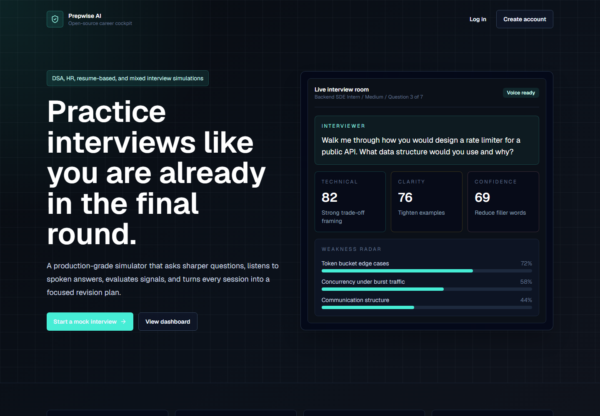
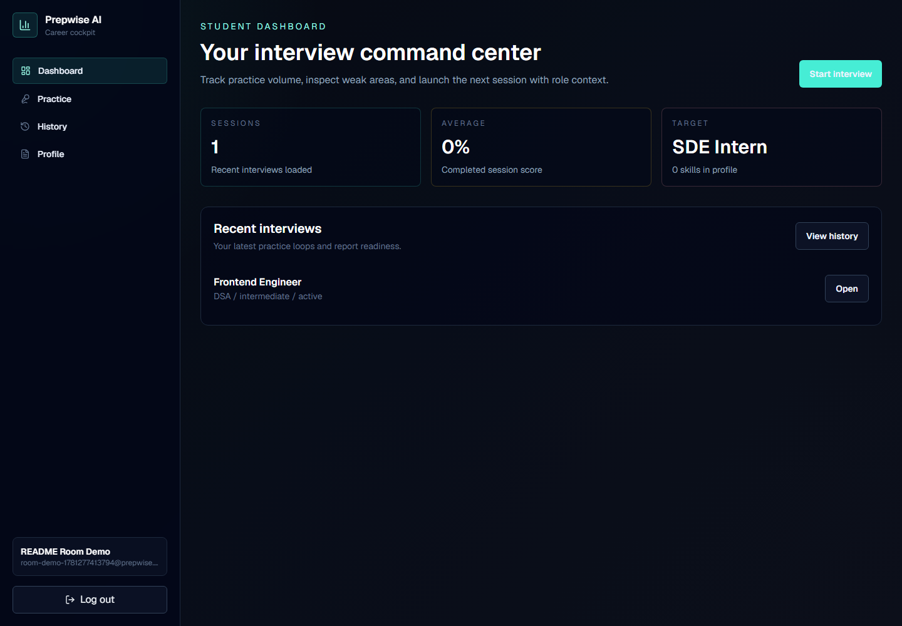
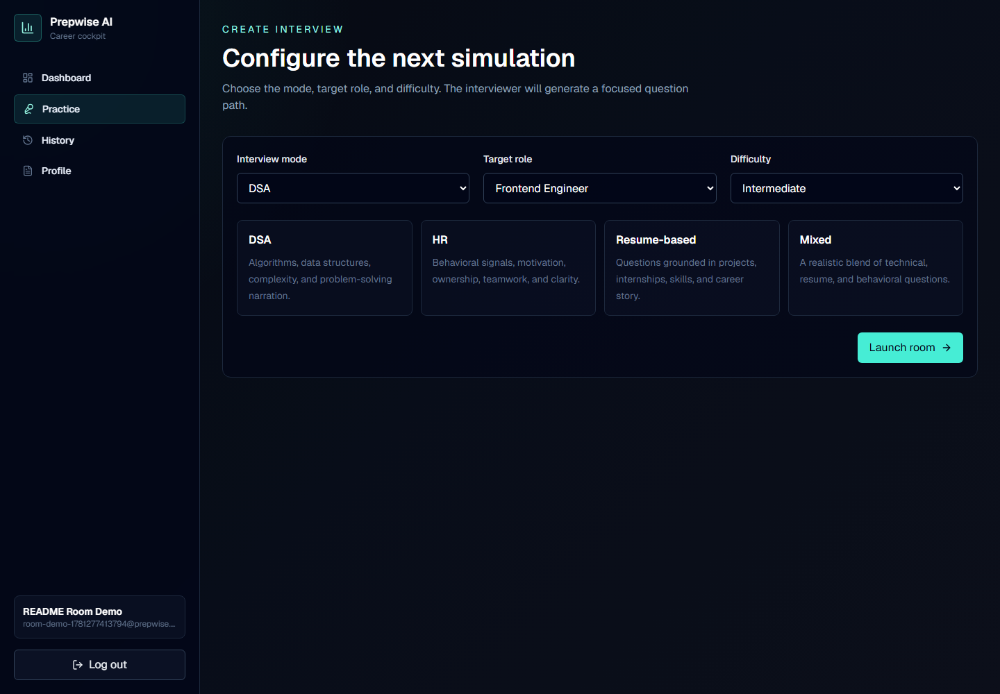
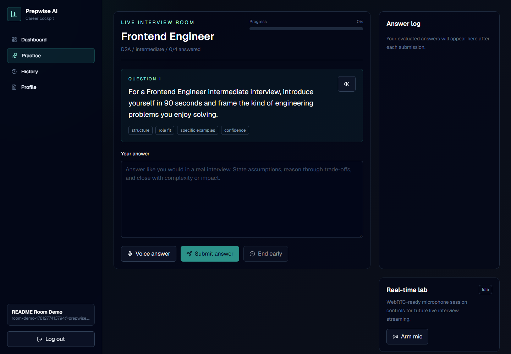
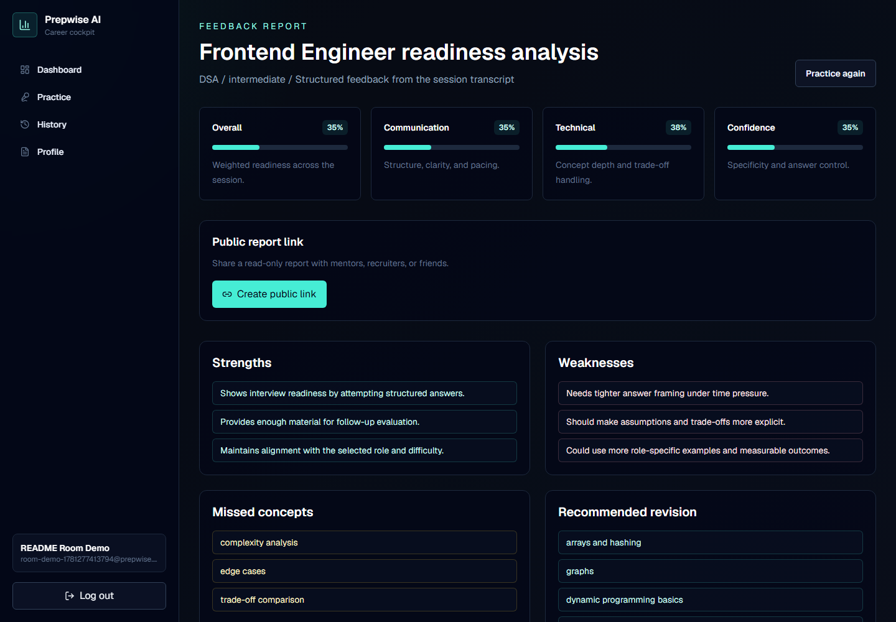
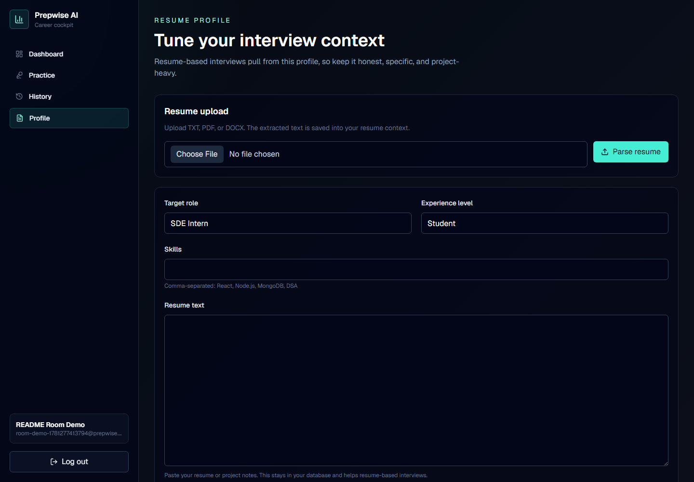
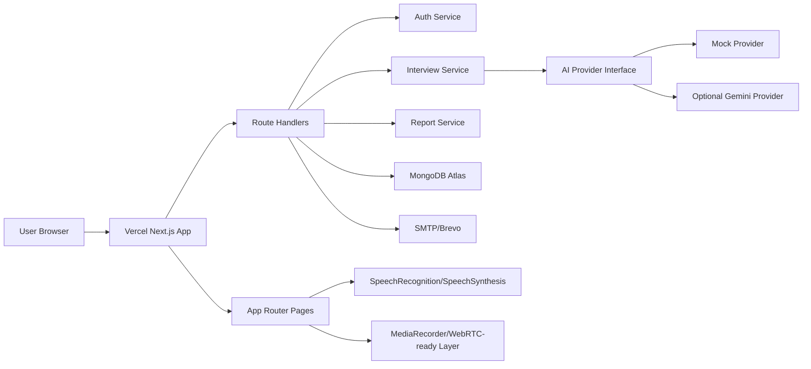

# Prepwise AI

Production-grade AI interview practice platform for students and job seekers.

[Live Demo](https://prepwise-ai-sooty.vercel.app) | [Repository](https://github.com/Rajtiwari0202/prepwise-ai) | [Architecture Plan](docs/technical-plan.md) | Current release: `v1.1.1`

Prepwise AI is a full-stack interview simulator built with a product mindset: authenticated dashboards, resume-aware question generation, live interview rooms, voice input/output, streamed answer feedback, detailed reports, public report sharing, admin analytics, and production deployment support.

The project is open-source friendly and free to run. It uses a local deterministic mock AI provider by default, with optional Gemini support. OpenAI and paid-only services are intentionally not required.

## Highlights

- Full-stack Next.js app deployed on Vercel
- MongoDB-backed interview history and reports
- Custom JWT auth with HTTP-only cookies
- Password reset and email verification via SMTP/Brevo
- Voice input and output in supported browsers
- WebRTC-ready microphone lab
- Resume parsing for TXT, PDF, and DOCX
- DSA, HR, resume-based, and mixed interview modes
- Streamed answer feedback
- Structured weakness analysis
- Public read-only report sharing
- Admin analytics dashboard
- API rate limiting
- Health endpoint, sitemap, robots, and production error screen

## Live Demo

Production URL:

```text
https://prepwise-ai-sooty.vercel.app
```

Health check:

```text
https://prepwise-ai-sooty.vercel.app/api/health
```

## Screenshots

### Landing Page



### Dashboard



### Create Interview



### Live Interview Room



### Feedback Report



### Resume Profile



## Product Flow

1. Candidate creates an account.
2. Candidate fills profile/resume context or uploads a resume.
3. Candidate selects interview mode, role, and difficulty.
4. AI generates a focused interview path.
5. Candidate answers using text or voice.
6. AI evaluates each answer and streams feedback.
7. Candidate completes the interview.
8. The platform generates a structured report.
9. Candidate reviews weakness analysis and revision topics.
10. Candidate can share a public read-only report link.

## Interview Modes

| Mode | Purpose |
| --- | --- |
| DSA | Data structures, algorithms, complexity, and problem-solving narration |
| HR | Behavioral signals, ownership, teamwork, conflict, and motivation |
| Resume-based | Questions grounded in projects, skills, internships, and experience |
| Mixed | Realistic blend of technical, behavioral, and resume-focused questions |

## Feature Matrix

| Area | Status |
| --- | --- |
| Landing page | Complete |
| Authentication | Complete |
| Password reset | Complete |
| Email verification | Complete |
| Student dashboard | Complete |
| Resume profile | Complete |
| TXT/PDF/DOCX resume parsing | Complete |
| Interview setup | Complete |
| Live interview room | Complete |
| Text answers | Complete |
| Voice input | Complete in supported browsers |
| Voice output | Complete |
| WebRTC-ready microphone layer | Complete |
| Streamed answer feedback | Complete |
| AI feedback reports | Complete |
| Weakness analysis | Complete |
| Interview history | Complete |
| Public report sharing | Complete |
| Admin analytics | Complete |
| Rate limiting | Complete |
| Health endpoint | Complete |
| Sitemap and robots | Complete |

## Tech Stack

| Layer | Technology |
| --- | --- |
| Frontend | Next.js App Router, React, TypeScript |
| Styling | Tailwind CSS |
| Backend | Next.js Route Handlers |
| Database | MongoDB, Mongoose |
| Auth | JWT, HTTP-only cookies, bcrypt |
| Validation | Zod |
| AI | Provider abstraction, mock provider, optional Gemini |
| Resume parsing | Mammoth, pdf-parse |
| Email | Nodemailer, SMTP/Brevo |
| Voice | Web Speech APIs, MediaRecorder |
| Deployment | Vercel, MongoDB Atlas |

## Architecture



## Key Routes

```text
/                         Landing page
/auth/login               Login
/auth/register            Register
/auth/forgot-password     Password reset request
/auth/reset-password      Password reset
/auth/verify              Email verification
/dashboard                Student dashboard
/interview/new            Create interview
/interview/[id]           Live interview room
/reports/[id]             Private feedback report
/share/[id]               Public shared report
/profile                  Resume/profile context
/history                  Interview history
/admin                    Admin analytics
/api/health               Deployment health check
```

## Project Structure

```text
app/
  admin/
  api/
  auth/
  dashboard/
  history/
  interview/
  profile/
  reports/
  share/
components/
  auth/
  interview/
  layout/
  profile/
  reports/
  ui/
data/
docs/
hooks/
lib/
  ai/
  auth/
  db/
  email/
  security/
  utils/
  validators/
models/
public/
  screenshots/
types/
```

## Getting Started

### 1. Clone

```bash
git clone https://github.com/Rajtiwari0202/prepwise-ai.git
cd prepwise-ai
```

### 2. Install

```bash
npm install
```

### 3. Configure Environment

Create `.env` from `.env.example`.

```bash
MONGODB_URI=mongodb://127.0.0.1:27017/interview_ai
JWT_SECRET=replace-with-a-long-random-secret
AI_PROVIDER=mock
GEMINI_API_KEY=
GEMINI_MODEL=gemini-1.5-flash
NEXT_PUBLIC_APP_URL=http://localhost:3000
ADMIN_EMAIL=
SMTP_HOST=
SMTP_PORT=587
SMTP_USER=
SMTP_PASS=
SMTP_FROM="Prepwise AI <no-reply@prepwise.local>"
```

### 4. Run Locally

```bash
npm run dev
```

Open:

```text
http://localhost:3000
```

## Environment Variables

| Variable | Required | Purpose |
| --- | --- | --- |
| `MONGODB_URI` | Yes | MongoDB connection string |
| `JWT_SECRET` | Yes | Signs auth cookies |
| `AI_PROVIDER` | Yes | `mock` or `gemini` |
| `GEMINI_API_KEY` | No | Optional Gemini key |
| `GEMINI_MODEL` | No | Gemini model name |
| `NEXT_PUBLIC_APP_URL` | Yes in production | App URL used in email links and metadata |
| `ADMIN_EMAIL` | No | Grants admin dashboard access to one email |
| `SMTP_HOST` | No | SMTP host for auth emails |
| `SMTP_PORT` | No | SMTP port, usually `587` |
| `SMTP_USER` | No | SMTP username |
| `SMTP_PASS` | No | SMTP password or SMTP API key |
| `SMTP_FROM` | No | From address for auth emails |

## Free AI Mode

The app works without any paid AI API:

```bash
AI_PROVIDER=mock
```

The mock provider generates deterministic questions, evaluations, and reports. This is useful for development, demos, and open-source deployment.

Optional Gemini mode:

```bash
AI_PROVIDER=gemini
GEMINI_API_KEY=your-gemini-key
GEMINI_MODEL=gemini-1.5-flash
```

If Gemini is selected but no key is configured, the app falls back to the mock provider.

## Email Setup With Brevo

For password reset and email verification in production, configure Brevo SMTP:

```bash
SMTP_HOST=smtp-relay.brevo.com
SMTP_PORT=587
SMTP_USER=your-brevo-login-email
SMTP_PASS=your-brevo-smtp-key
SMTP_FROM="Prepwise AI <your-verified-sender-email>"
NEXT_PUBLIC_APP_URL=https://prepwise-ai-sooty.vercel.app
```

If SMTP is not configured, the app still runs. In development, email content is logged server-side.

## Admin Dashboard

Set:

```bash
ADMIN_EMAIL=your-email@example.com
```

Then log in with that email and visit:

```text
/admin
```

The admin dashboard shows high-level usage metrics and recent interview activity.

## Deployment

Recommended production setup:

- Vercel for the full-stack Next.js app
- MongoDB Atlas for the database
- Brevo SMTP for auth emails
- `AI_PROVIDER=mock` for a fully free AI demo
- Optional Gemini for richer AI responses

Vercel deploy settings:

```text
Framework: Next.js
Build command: npm run build
Install command: npm install
Output directory: default
```

Production environment example:

```bash
MONGODB_URI=mongodb+srv://<user>:<password>@<cluster-url>/prepwise_ai?retryWrites=true&w=majority
JWT_SECRET=your-long-production-secret
AI_PROVIDER=mock
NEXT_PUBLIC_APP_URL=https://prepwise-ai-sooty.vercel.app
ADMIN_EMAIL=you@example.com
SMTP_HOST=smtp-relay.brevo.com
SMTP_PORT=587
SMTP_USER=your-brevo-email
SMTP_PASS=your-brevo-smtp-key
SMTP_FROM="Prepwise AI <your-verified-email>"
```

## Scripts

```bash
npm run dev
npm run build
npm run start
npm run lint
npm run typecheck
```

## Voice Support

Voice output uses browser speech synthesis and works broadly across modern browsers.

Voice input uses browser speech recognition, which is best supported in:

- Google Chrome
- Microsoft Edge

If voice input does not work, allow microphone access in the browser or answer with text.

The real-time lab uses browser microphone permissions and `MediaRecorder` as the foundation for future WebRTC streaming.

## Database Models

- `User`
- `Profile`
- `Interview`
- `Question`
- `Answer`
- `FeedbackReport`
- `AuthToken`

## Security Notes

- Passwords are hashed with bcrypt.
- JWT sessions are stored in HTTP-only cookies.
- Password reset and email verification tokens are hashed before storage.
- API routes validate input with Zod.
- API routes include lightweight rate limiting.
- `.env` is ignored by git.
- Public report links use opaque share IDs.
- Real API keys and database credentials should never be committed.

## Release History

| Version | Summary |
| --- | --- |
| `v1.0.0` | Initial public MVP with polished README and screenshots |
| `v1.0.1` | Minimal product UI polish |
| `v1.1.0` | Password reset, email verification, resume parsing, public report sharing, admin analytics, rate limiting, streamed feedback, WebRTC-ready controls |
| `v1.1.1` | Brand consistency, admin nav, health endpoint, production error page, sitemap, robots, metadata polish |

## Roadmap

- Redis-backed distributed rate limiting
- Interview timer and proctor-style signals
- Full WebRTC media server mode
- Rich HTML email templates
- Organization/team workspaces
- Automated test suite
- Report export to PDF

## Audit Note

`npm audit` may report moderate advisories through framework/transitive dependencies and suggest breaking downgrade paths. Avoid `npm audit fix --force` unless the resulting dependency changes are reviewed.

## License

MIT
