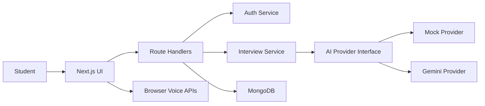

# AI Interview Simulator Platform Technical Plan

## Product Scope

AI Interview Simulator Platform is an open-source interview practice cockpit for students and job seekers. It supports DSA, HR, resume-based, and mixed interviews with text and browser-native voice interaction. The default AI mode is a free local mock provider so the product runs without paid APIs. Optional free-tier providers can be enabled through environment variables.

## Architecture

- **Frontend:** Next.js App Router, TypeScript, Tailwind CSS.
- **Backend:** Next.js route handlers for auth, profile, interview orchestration, answer evaluation, and reports.
- **Database:** MongoDB with Mongoose models.
- **Auth:** Custom JWT in HTTP-only cookies with bcrypt password hashing.
- **AI:** Provider abstraction with mock and Gemini providers. OpenAI is intentionally excluded.
- **Voice:** Browser `SpeechRecognition` and `SpeechSynthesis` through reusable hooks.
- **Caching:** Redis is not required for the first production slice. The service layer keeps a clean boundary for future caching.

## System Flow



## Database Schema

### User
- `name`
- `email`
- `passwordHash`
- `createdAt`
- `updatedAt`

### Profile
- `userId`
- `targetRole`
- `experienceLevel`
- `skills`
- `resumeText`
- `createdAt`
- `updatedAt`

### Interview
- `userId`
- `mode`
- `role`
- `difficulty`
- `status`
- `currentQuestionIndex`
- `summary`
- `createdAt`
- `updatedAt`
- `completedAt`

### Question
- `interviewId`
- `text`
- `type`
- `topic`
- `expectedSignals`
- `order`

### Answer
- `interviewId`
- `questionId`
- `text`
- `transcriptSource`
- `evaluation`
- `score`
- `createdAt`

### FeedbackReport
- `interviewId`
- `overallScore`
- `communicationScore`
- `technicalScore`
- `confidenceScore`
- `strengths`
- `weaknesses`
- `missedConcepts`
- `suggestedImprovements`
- `recommendedTopics`
- `sampleAnswers`
- `transcript`
- `createdAt`

## Folder Structure

```text
app/
  api/
  auth/
  dashboard/
  interview/
  reports/
components/
  dashboard/
  interview/
  layout/
  reports/
  ui/
data/
docs/
hooks/
lib/
  ai/
  auth/
  db/
  validators/
models/
types/
```

## UI Direction

The interface should feel like a serious interview lab and career cockpit: dark surfaces, subtle borders, controlled gradients, sharp typography, dense but readable dashboards, and product-specific microcopy. It should prioritize workflows over marketing decoration.

## Milestones

1. Initialize foundation, docs, Tailwind, TypeScript, env, and git hygiene.
2. Add MongoDB models, auth services, validators, and route handlers.
3. Add AI provider abstraction and interview orchestration services.
4. Build landing, auth, dashboard, interview creation, and profile pages.
5. Build live interview room with text and voice controls.
6. Build report detail and history pages with weakness analysis.
7. Verify build/type health and update README.

## Commit Plan

- `chore: initialize next app foundation`
- `docs: add architecture plan and diagrams`
- `feat: add auth and database models`
- `feat: add AI interview service abstraction`
- `feat: add dashboard and interview setup flow`
- `feat: add live interview room with voice controls`
- `feat: add feedback reports and history`
- `docs: update setup instructions`
